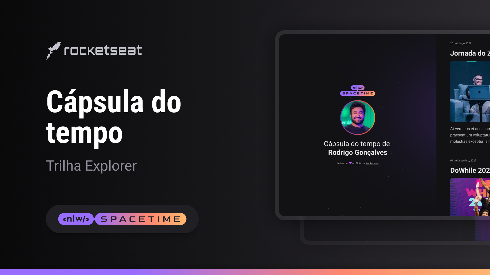

 
    

## 💻 Projeto
Esse é um projeto Web responsivo de uma capsula do tempo para exibir memórias em uma linha do tempo.

## 🚀 Tecnologias
Esse projeto  foi desenvolvido durante o nlw da Rockset com as seguintes tecnologias:

- HTML
- CSS
- Git e Github

## 👉 Layout
Você pode vsualizar o layout do projeto através
[desse link](https://www.figma.com/file/s5cAZqHamroPLYvLmolBIY/C%C3%A1psula-do-tempo-%E2%80%A2-Trilha-Explorer-(Community)-(Copy)?type=design&node-id=306%3A84&t=wsIDzxJ8dErktJkq-1).
É necessário er uma conta no [Figma](https://www.figma.com)
